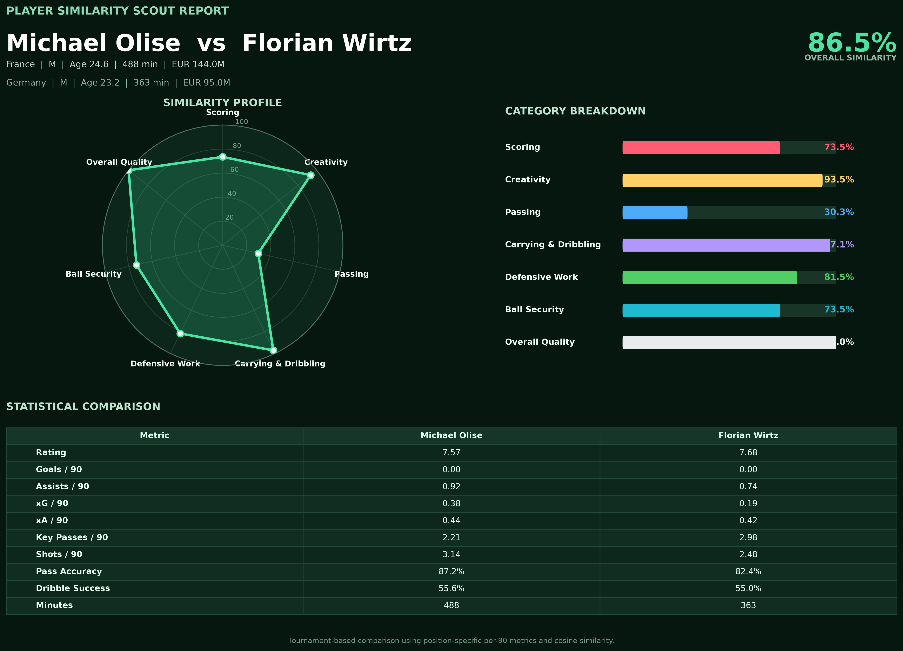
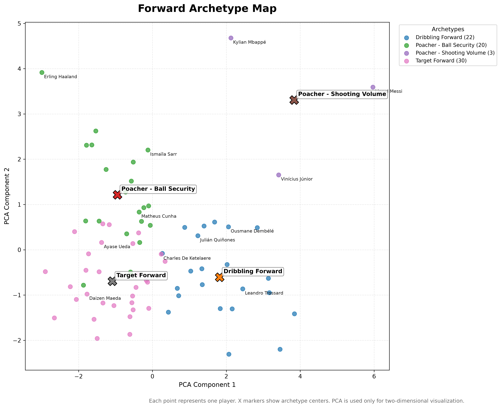
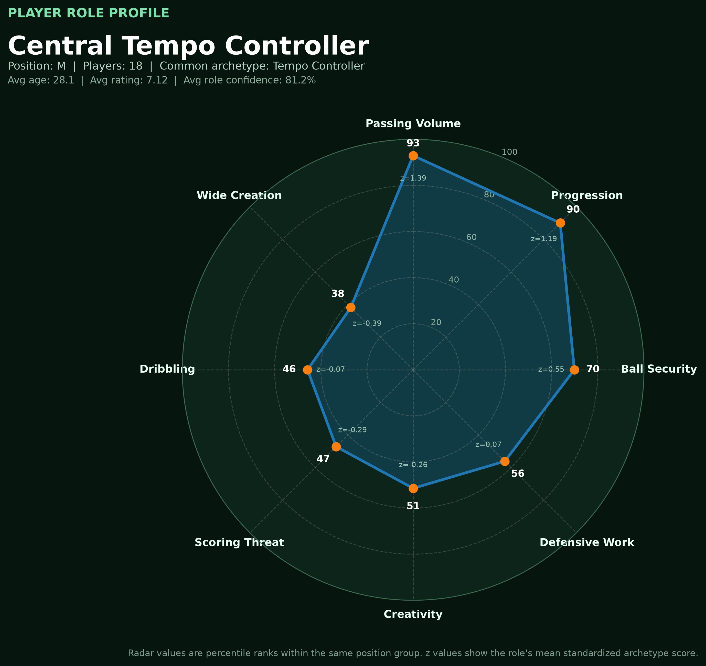
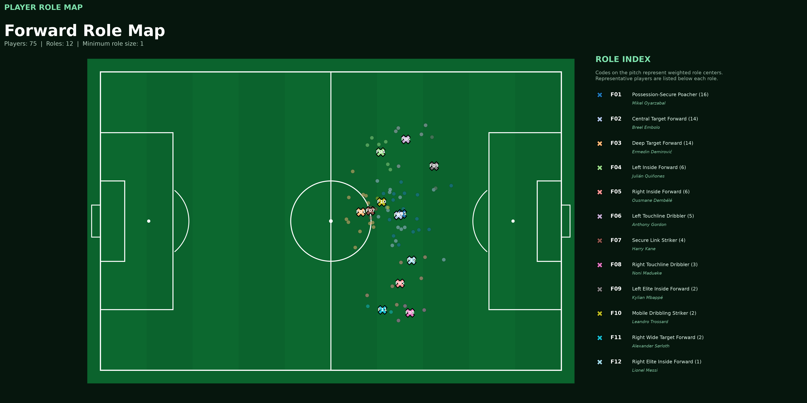
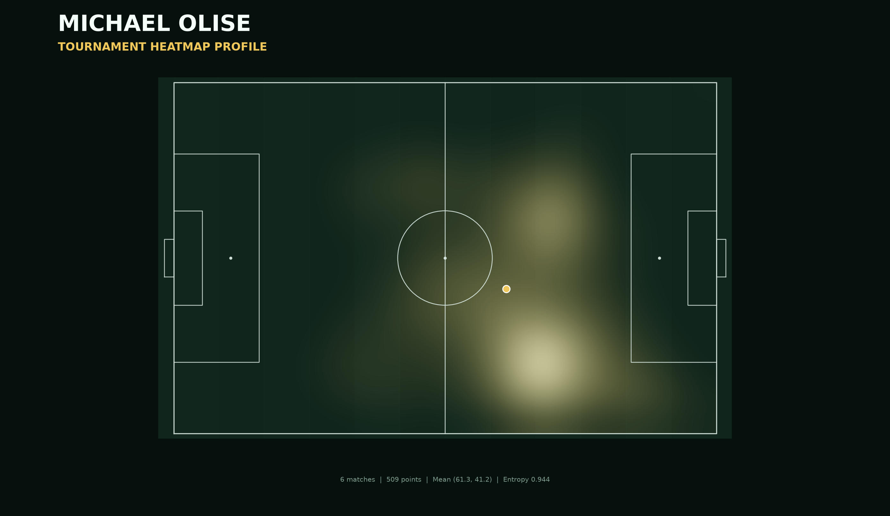
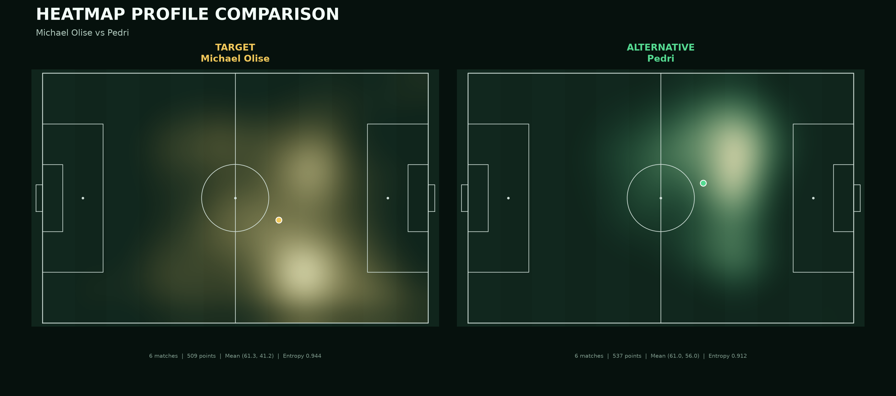
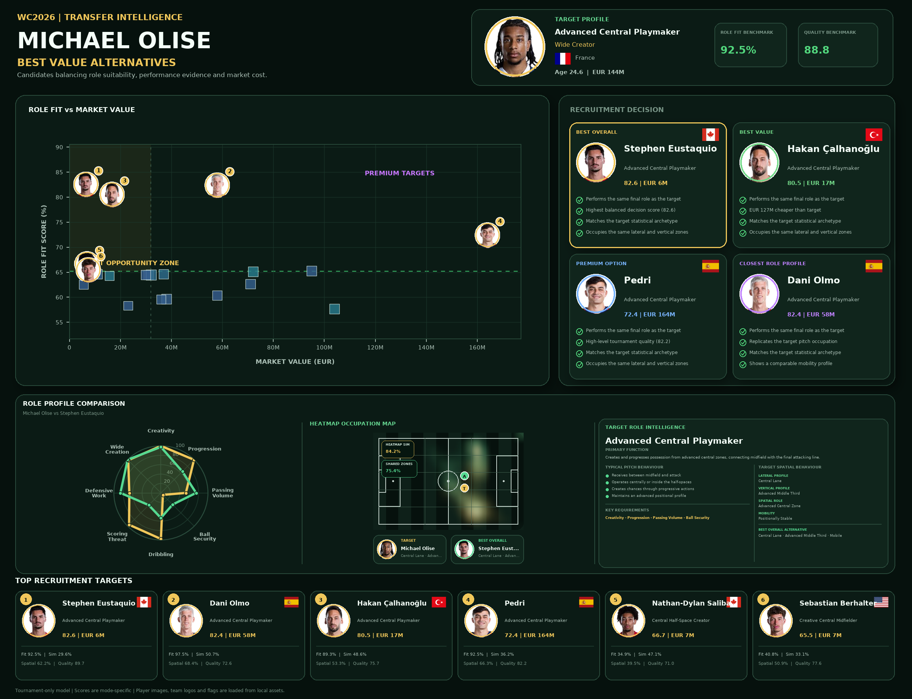

# ⚽ FIFA World Cup 2026 Analytics
[](https://github.com/MelihSiskular/world-cup-2026/actions/workflows/python-quality.yml)


## Project Overview

>Machine Learning powered football analytics platform built from FIFA World Cup 2026 tournament data.


By integrating match statistics, market values, positional information, heatmaps and unsupervised learning techniques, the platform explores player performance, tactical roles, similarity networks and transfer opportunities beyond traditional football metrics.
The project focuses on these main areas:


-  Goal Analysis
-  Player Performance Analysis
-  Player Similarity Engine
-  Player Archetypes
-  Player Positioning Analysis
-  Player Role Discovery
-  Player Heatmap Visualization
-  Transfer Intelligence Engine

---

## Quick Start

### Installation

```bash
git clone https://github.com/MelihSiskular/world-cup-2026.git
cd world-cup-2026

python3.12 -m venv .venv
source .venv/bin/activate

python -m pip install --upgrade pip
python -m pip install -e ".[dev]"
```

### Transfer Intelligence CLI

Run a transfer replacement analysis:

```bash
wc26-transfer \
  --player "Michael Olise" \
  --top-n 5
```

Example with recruitment constraints:

```bash
wc26-transfer \
  --player "Michael Olise" \
  --minimum-minutes 250 \
  --minimum-role-confidence 65 \
  --maximum-market-value 80000000 \
  --top-n 5
```

Display all available options:

```bash
wc26-transfer --help
```

The legacy module command remains available for backward compatibility:

```bash
python -m src.transfer_intelligence.find_replacements \
  --player "Michael Olise"
```

# 1 - Goal Analysis

Goal-related datasets are used to analyze:

- Goal timing distributions
- Team scoring tendencies
- Late-game goal patterns
- Goal bucket analysis
- Tournament-wide scoring trends

### Example


### Example


---

# 2 - Player Performance Analysis

Player-level match statistics are used to evaluate:

- Match ratings
- Position-specific performance
- Stage-based rankings
- Team of the Week selections
- Formation comparisons

### Example
The following example filters the highest-rated forwards from the first group-stage matchday.

```python
import pandas as pd

# Available in data folder
df = pd.read_csv(
    "data/processed/weekly_team_analysis/"
    "top_players_by_stage_position.csv"
)

# Top 10 Forward Players
top_forwards = df[
    (df["round_number"] == 1)
    & (df["analysis_position"] == "F")
].head(10)

print(
    top_forwards[
        [
            "position_rank",
            "player_name",
            "national_team_name",
            "opponent_team_name",
            "stat_minutesPlayed",
            "stat_rating",
        ]
    ]
)
```

| Rank | Player | Team | Opponent | Minutes | Rating |
|---:|---|---|---|---:|---:|
| 1 | Lionel Messi | Argentina | Algeria | 80 | 10.0 |
| 2 | Folarin Balogun | USA | Paraguay | 72 | 9.0 |
| 3 | Alexander Isak | Sweden | Tunisia | 89 | 8.6 |
| 4 | Kai Havertz | Germany | Curaçao | 90 | 8.4 |
| 5 | Luis Díaz | Colombia | Uzbekistan | 89 | 8.2 |
| 6 | Crysencio Summerville | Netherlands | Japan | 70 | 8.1 |
| 7 | Amad Diallo | Côte d'Ivoire | Ecuador | 34 | 8.0 |
| 8 | Deniz Undav | Germany | Curaçao | 26 | 7.9 |
| 9 | Harry Kane | England | Croatia | 90 | 7.8 |
| 10 | Kang-in Lee | South Korea | Czechia | 90 | 7.7 |

### Example

The following example the best line-up for 4-3-3 formation in first group match

---

# 3 - Player Similarity Engine

### Player Profile

| Player | Team | Position | Age | Minutes | Rating | Market Value |
|---|---|---|---:|---:|---:|---:|
| Michael Olise | France | M | 24.6 | 488 | 7.57 | EUR 144.0M |

This report identifies statistically similar players within the same broad
position group. The model uses position-specific, reliability-adjusted per-90
features, StandardScaler and cosine similarity.

### Example

```python

python -m src.player_similarity.breakdown.create_similarity_report \

    --player "Michael Olise"
```


### Closest Players

| Rank | Player | Team | Age | Minutes | Rating | Market Value | Similarity |
|---:|---|---|---:|---:|---:|---:|---:|
| 1 | Florian Wirtz | Germany | 23.2 | 363 | 7.68 | EUR 95.0M | 86.55% |
| 2 | Sadio Mané | Senegal | 34.3 | 364 | 6.90 | EUR 5.6M | 69.09% |
| 3 | Andreas Schjelderup | Norway | 22.1 | 251 | 7.37 | EUR 31.0M | 68.79% |
| 4 | Nicolás González | Argentina | 28.3 | 182 | 6.87 | EUR 23.0M | 67.50% |
| 5 | Lamine Yamal | Spain | 19.0 | 405 | 7.25 | EUR 215.0M | 64.76% |
| 6 | Martin Ødegaard | Norway | 27.6 | 471 | 6.93 | EUR 71.0M | 63.68% |
| 7 | Johan Manzambi | Switzerland | 20.7 | 200 | 7.77 | EUR 54.0M | 63.35% |
| 8 | Mohamed Salah | Egypt | 34.1 | 428 | 7.24 | EUR 21.0M | 60.36% |
| 9 | Bruno Guimarães | Brazil | 28.7 | 419 | 7.15 | EUR 72.0M | 60.35% |
| 10 | Brahim Díaz | Morocco | 26.9 | 462 | 6.85 | EUR 37.0M | 59.94% |

### Quick Summary

- **Most similar player:** Florian Wirtz
- **Highest overall similarity:** 86.55%
- **Strongest matching areas:** Overall Quality (100.0%), Carrying & Dribbling (97.1%), Creativity (93.5%)
- **Candidate list size:** 10


## Detailed One-to-One Comparisons

---

# 4 - Player Archetypes

Players are automatically grouped into football-specific archetypes using unsupervised machine learning.

Different position groups are clustered independently:

- Goalkeepers
- Defenders
- Midfielders
- Forwards

### Examples:

Player | Team | Position | Archetype | Key Strengths |
|---|---|---|---|---|
| Michael Olise | France | M | Wide Creator | Creativity, Progression, Dribbling |
| Florian Wirtz | Germany | M | Wide Creator | Creativity, Passing, Progression |
| Rodri | Spain | M | Tempo Controller | Passing Volume, Progression, Ball Security |
| Leandro Paredes | Argentina | M | Tempo Controller | Progression, Passing Volume, Ball Security |
| Jude Bellingham | England | M | Goal-Threat Midfielder | Scoring Threat, Dribbling, Creativity |
| Declan Rice | England | M | Ball-Winning Midfielder | Defensive Work, Duels, Recoveries |
| Pau Cubarsí | Spain | D | Ball-Carrying Defender | Progression, Passing, Ball Carrying |
| Nuno Mendes | Portugal | D | Attacking Full-Back | Wide Attack, Progression, Crossing |
| Thibaut Courtois | Belgium | G | Commanding Goalkeeper | Box Command, Long Distribution, Sweeping |
| Kylian Mbappé | France | F | Poacher - Shooting Volume | Finishing, Shooting Volume, Dribbling |

### Example Player Query

```bash
python -m src.player_archetypes.show_player \
  --player "Michael Olise"
```

```text
Player:        Michael Olise
Team:          France
Position:      M
Archetype:     Wide Creator
Cluster Size:  29

Top Archetype Strengths:
- Creativity
- Progression
- Wide Creation
- Dribbling

Closest Members:
1. Florian Wirtz
2. Sadio Mané
3. Andreas Schjelderup
4. Nicolás González
5. Martin Ødegaard
```

### Examples - Archtype Map


Each point represents one player. Players positioned close to each other have
similar statistical role profiles. The `X` markers represent archetype centers.

> Archetypes describe tournament-based statistical production. They should not
> be interpreted as definitive tactical roles without positional tracking,
> touch maps and longer-term performance data.

> The important point to emphasize here is the existence of a role called 'Poacher - Shooting Volume', which includes only three players: Messi, Mbappe, and Vini Jr." We able to say that they are something else.


# 5 - Player Positioning Analysis
Player positioning data is average-position maps and aggregated across the tournament.
With this positioning engine analyzes following topics.

* Average player locations
* Horizontal lane occupation
* Vertical pitch occupation
* Spatial spread and mobility
* Position stability

### Example Spatial Profiles

Player | Team | Position | Lateral Profile | Vertical Profie       | Mobility            |
|---|---|---|-----------------|-----------------------|---------------------|
| Michael Olise | France | M | Central Lane    | Advanced Middle Third | Positionally Stable |
| Rodri | Spain | M | Central Lane    | Final Third           | Roaming             |
| Jude Bellingham | England | M | Central Lane    | Middle Third          | Positionally Stable |
| Nuno Mendes | Portugal | D | Left Wide Lane  | Advanced Middle Third | Dynamic             |
| Kylian Mbappé | France | F | Left Half Space | Final Third           | Roaming             |

*The system automatically converts raw average-position coordinates into interpretable spatial behavior profiles.*

# 6 - Player Role Discovery


Player roles are discovered by combining statistical archetypes and spatial behaviour to identify football-specific role identities.
Instead of describing a player only through statistics, the project attempts to answer:
> What role does this player actually perform on the pitch?

### Example Role Query
```python
python -m src.player_roles.show_player_role \
  --player "Michael Olise"
```

```output
Player: Michael Olise

Role:
Advanced Central Playmaker

Archetype:
Wide Creator

Spatial Profile:
Advanced Central Zone

Confidence:
87.2%
```

### Example Role Explorer

```python
python -m src.player_roles.show_role \
  --role "Central Tempo Controller"
```
```out
==============================================================================
ROLE EXPLORER REPORT
==============================================================================

Role:                    Central Tempo Controller
Position Group:          M
Player Count:            18
Common Archetype:        Tempo Controller
Common Spatial Role:     Central Build-Up Zone
Common Lateral Profile:  Central Lane
Common Vertical Profile: Advanced Middle Third
Common Mobility Profile: Positionally Stable

ROLE AVERAGES
------------------------------------------------------------------------------
Average Age:             28.14
Average Rating:          7.12
Average Market Value:    €32.6M
Average Mean X:          51.14
Average Mean Y:          51.68
Average Spatial Spread:  5.97
Average Confidence:      81.19%

TOP PLAYERS
------------------------------------------------------------------------------
           player_name          team  age minutes rating market_value        archetype             spatial_role confidence role_score
          Granit Xhaka   Switzerland 33.8     600   7.53        €8.5M Tempo Controller       Central Half-Space     86.73%      85.94
                 Rodri         Spain 30.1     537   7.69       €45.0M Tempo Controller    Central Build-Up Zone     86.69%      84.33
       Elliot Anderson       England 23.7     533   7.25       €68.0M Tempo Controller    Central Build-Up Zone     86.84%      82.94
         Adrien Rabiot        France 31.3     450   7.08       €17.3M Tempo Controller          Left Half-Space     87.24%      79.86
               Vitinha      Portugal 26.4     381   7.29      €130.0M Tempo Controller    Central Build-Up Zone     87.97%      78.56
       Rodrigo De Paul     Argentina 32.1     407   7.08       €14.5M Tempo Controller         Right Half-Space     87.47%      78.54
       Leandro Paredes     Argentina 32.0     334   7.57        €5.3M Tempo Controller    Central Build-Up Zone     88.50%      78.10
             Manu Koné        France 25.2     341   7.04       €47.0M Tempo Controller    Central Build-Up Zone     86.41%      75.68
    Idrissa Gana Gueye       Senegal 36.8     364   7.19        €485K Tempo Controller    Central Build-Up Zone     79.57%      73.50
       Frenkie de Jong   Netherlands 29.2     331   7.07       €32.0M Tempo Controller    Central Build-Up Zone     79.57%      72.04
   Aleksandar Pavlović       Germany 22.2     274   6.82       €96.0M Tempo Controller    Central Build-Up Zone     82.93%      71.07
```
*The Central Tempo Controller role contains midfielders who operate mainly in
central build-up areas and influence the speed and direction of possession.*

*Players such as Rodri, Granit Xhaka, Vitinha, Leandro Paredes and Frenkie de Jong
appear in this role because they combine a Tempo Controller statistical
archetype with a central and positionally stable spatial profile.*

**Role Confidence** *measures how closely a player matches the discovered role profile.*

**Role Score** *combines role confidence, tournament rating and minutes played to rank the strongest representatives of a role.*

### Example Role Visualization

```python
python -m src.player_roles.visualize_role \
  --role "Central Tempo Controller"
```

In this example, the **Central Tempo Controller** role is characterized by:

- Elite Passing Volume (%93)

- Strong Progression ability (%90)

- Above-average Ball Security (%70)

- Limited Scoring Threat and Dribbling involvement

This profile represents midfielders who primarily control possession, circulate the ball, and drive build-up play from central areas. Typical examples include players such as Rodri, Vitinha, Leandro Paredes and Granit Xhaka.

Percentile values are calculated relative to players within the same position group.

### Example Role Maps

*Role Maps bridge the gap between statistical archetypes and on-pitch positioning, producing interpretable football roles from tournament data.*

---

# 7 - Player Heatmap Visualization

Average positions alone cannot fully describe how players occupy space.

To better capture on-pitch behaviour, the project generates normalized player heatmaps and compares them across the tournament.

The heatmap engine measures:

- Heatmap similarity
- Shared zone occupation
- Peak zone similarity
- Lateral occupation similarity
- Vertical occupation similarity
- Spatial entropy similarity

This allows the project to answer:

> Do two players actually use the same areas of the pitch?
>
> With same intensity?

### Example - Michael Olise Heatmap


### Example - Michael Olise vs Pedri Heatmap


---

# 8 - Transfer Intelligence Engine

The Transfer Intelligence Engine combines every previous layer of analysis.

Inputs:

- Statistical Similarity
- Archetype Compatibility
- Role Compatibility
- Spatial Similarity
- Heatmap Similarity
- Market Value
- Age Profile
- Tournament Quality
- Data Reliability

The objective is not to find the most similar player.

The objective is to find the most suitable replacement.

The Engine produces four recommendation categories



## Example Transfer Query

```bash
wc26-transfer \
  --player "Michael Olise"
```

The engine produces four recruitment scenarios:

 Player          | Team              |
|-----------------|-------------------|
| Best Overall    | Stephen Eustaquio |
| Best Value      | Hakan Çalhanoğlu  |
| Premium Option  | Pedri             |
| Closest Role Profile     | Dani Olmo         |

 ---


*I'm so happy that this project evolved from a world cup analytics dataset into a football scouting and recruitment intelligence platform*

## Generated Datasets

### Goal Analysis

- `world_cup_2026_goals_sofascore.csv`
- `team_goal_buckets.csv`

### Player Performance

- `matches.csv`
- `player_match_stats.csv`
- `top_players_by_stage_position.csv`
- `teams_by_formation.csv`

### Player Similartiy
- `player_similarity_breakdown_long.csv`

### Player Archetypes
- `archetype_summary.csv`
- `player_archetypes.csv`

### Player Positioning Analysis
- `player_spatial_profiles.csv`

### Player Roles
- `player_roles.csv`

### Player Heatmaps
- `player_heatmaps_match_level`

### Transfer Intelligence
- `transfer_feature_table`

---

## Technologies

- Python
- Pandas
- Playwright
- Matplotlib
- Pillow
- Numpy
- Scikit-Learn
- Cosine Similarity
- K-Means Clustering
- PCA


---

## Project Structure

```text
world-cup-2026/
├── .github/
│   └── workflows/
│       └── python-quality.yml
├── data/
│   └── processed/
├── docs/
│   ├── DEVELOPMENT.md
│   └── images/
├── src/
│   ├── wc26/
│   │   ├── core/
│   │   │   └── paths.py
│   │   └── analytics/
│   │       └── transfer_intelligence/
│   │           ├── candidates.py
│   │           ├── cli.py
│   │           ├── config.py
│   │           ├── datasets.py
│   │           ├── entrypoint.py
│   │           ├── explanations.py
│   │           ├── matching.py
│   │           ├── recommendations.py
│   │           ├── reporting.py
│   │           ├── scoring.py
│   │           ├── service.py
│   │           └── utils.py
│   ├── goal_minute/
│   ├── player_archetypes/
│   ├── player_heatmaps/
│   ├── player_positioning/
│   ├── player_roles/
│   ├── player_similarity/
│   └── transfer_intelligence/
├── tests/
│   ├── unit/
│   └── integration/
├── pyproject.toml
└── README.md
```

---

## Backend API

The project includes a FastAPI backend foundation for exposing the Transfer
Intelligence engine through HTTP endpoints.

### Run the development server

Activate the project virtual environment and install the development
dependencies:

```bash
source .venv/bin/activate
python -m pip install -e ".[dev]"

python -m uvicorn wc26.api.main:app \
  --reload \
  --host 127.0.0.1 \
  --port 8000

```

---
## Sample Insights

Examples of questions that can be answered using this project:

- Which minute ranges produced the highest number of goals?
- How would a Team of the Week look in different formations?- Which defenders performed best during the group stage?
- Who are the closest alternatives to well known players?
- Which players have the most unique statistical profiles?
- How do player roles distribute across the pitch?
- Which Player I should transfer to my team and why?
---


## Data Source

Match events and player statistics are collected from SofaScore and transformed into analytical datasets for educational and research purposes.

---

## Author

- Melih Şişkular
