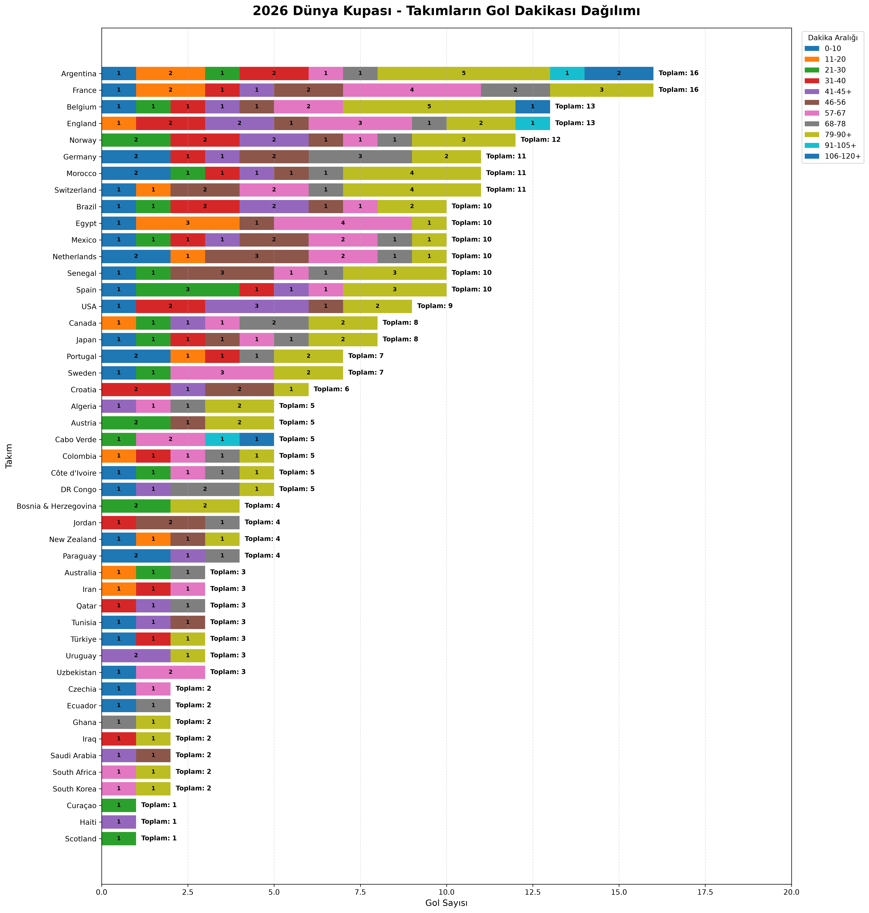
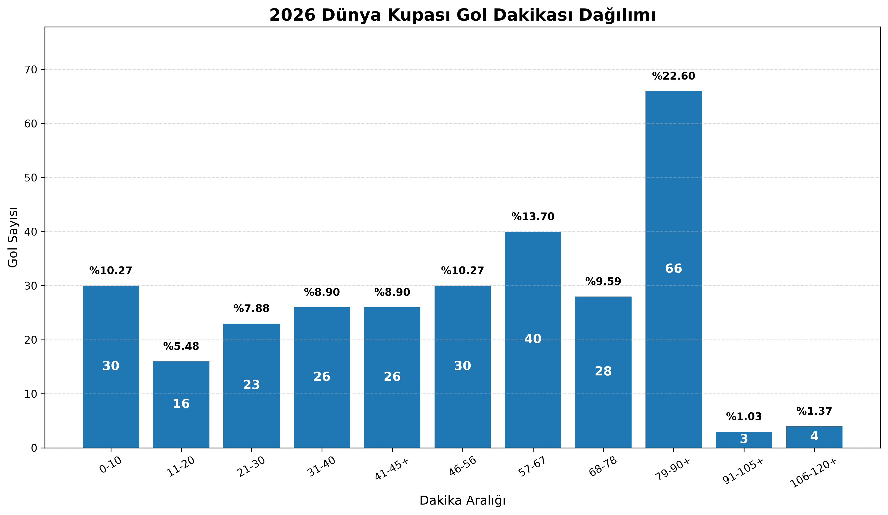
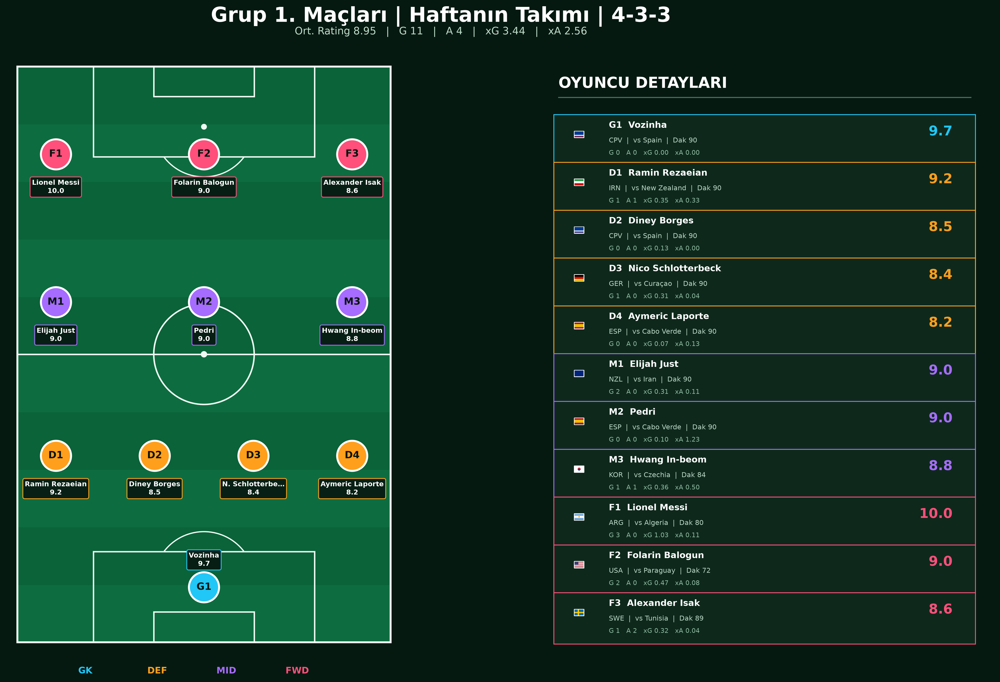

# ⚽ FIFA World Cup 2026 Analytics

A data analytics project built around the 2026 FIFA World Cup using player-level and goal-level statistics collected from SofaScore.

The project focuses on two main areas:

-  Goal Analysis
-  Player Performance Analysis
-  Player Similarity Engine

---

## Project Overview

This project collects and processes World Cup match data to create analytical datasets, rankings, visualizations, and team-of-the-week selections.

The goal is to transform raw football match events into meaningful insights about following topics.

---

# Goal Analysis

Goal-related datasets are used to analyze:

- Goal timing distributions
- Team scoring tendencies
- Late-game goal patterns
- Goal bucket analysis
- Tournament-wide scoring trends

### Example


### Example


---

# Player Performance Analysis

Player-level match statistics are used to evaluate:

- Match ratings
- Position-specific performance
- Stage-based rankings
- Team of the Week selections
- Formation comparisons

### Example
The following example filters the highest-rated forwards from the first group-stage matchday.

```python
import pandas as pd

# Available in data folder
df = pd.read_csv(
    "data/processed/weekly_team_analysis/"
    "top_players_by_stage_position.csv"
)

# Top 10 Forward Players 
top_forwards = df[
    (df["round_number"] == 1)
    & (df["analysis_position"] == "F")
].head(10)

print(
    top_forwards[
        [
            "position_rank",
            "player_name",
            "national_team_name",
            "opponent_team_name",
            "stat_minutesPlayed",
            "stat_rating",
        ]
    ]
)
```
### Sample Output
| Rank | Player | Team | Opponent | Minutes | Rating |
|---:|---|---|---|---:|---:|
| 1 | Lionel Messi | Argentina | Algeria | 80 | 10.0 |
| 2 | Folarin Balogun | USA | Paraguay | 72 | 9.0 |
| 3 | Alexander Isak | Sweden | Tunisia | 89 | 8.6 |
| 4 | Kai Havertz | Germany | Curaçao | 90 | 8.4 |
| 5 | Luis Díaz | Colombia | Uzbekistan | 89 | 8.2 |
| 6 | Crysencio Summerville | Netherlands | Japan | 70 | 8.1 |
| 7 | Amad Diallo | Côte d'Ivoire | Ecuador | 34 | 8.0 |
| 8 | Deniz Undav | Germany | Curaçao | 26 | 7.9 |
| 9 | Harry Kane | England | Croatia | 90 | 7.8 |
| 10 | Kang-in Lee | South Korea | Czechia | 90 | 7.7 |

### Example

The following example the best line-up for 4-3-3 formation in first group match

---

# Player Similarity Report: Michael Olise

## Player Profile

| Player | Team | Position | Age | Minutes | Rating | Market Value |
|---|---|---|---:|---:|---:|---:|
| Michael Olise | France | M | 24.6 | 488 | 7.57 | EUR 144.0M |

This report identifies statistically similar players within the same broad
position group. The model uses position-specific, reliability-adjusted per-90
features, StandardScaler and cosine similarity.

### Example

```python

python -m src.player_similarity.breakdown.create_similarity_report \

    --player "Michael Olise"
```


## Closest Players

| Rank | Player | Team | Age | Minutes | Rating | Market Value | Similarity |
|---:|---|---|---:|---:|---:|---:|---:|
| 1 | Florian Wirtz | Germany | 23.2 | 363 | 7.68 | EUR 95.0M | 86.55% |
| 2 | Sadio Mané | Senegal | 34.3 | 364 | 6.90 | EUR 5.6M | 69.09% |
| 3 | Andreas Schjelderup | Norway | 22.1 | 251 | 7.37 | EUR 31.0M | 68.79% |
| 4 | Nicolás González | Argentina | 28.3 | 182 | 6.87 | EUR 23.0M | 67.50% |
| 5 | Lamine Yamal | Spain | 19.0 | 405 | 7.25 | EUR 215.0M | 64.76% |
| 6 | Martin Ødegaard | Norway | 27.6 | 471 | 6.93 | EUR 71.0M | 63.68% |
| 7 | Johan Manzambi | Switzerland | 20.7 | 200 | 7.77 | EUR 54.0M | 63.35% |
| 8 | Mohamed Salah | Egypt | 34.1 | 428 | 7.24 | EUR 21.0M | 60.36% |
| 9 | Bruno Guimarães | Brazil | 28.7 | 419 | 7.15 | EUR 72.0M | 60.35% |
| 10 | Brahim Díaz | Morocco | 26.9 | 462 | 6.85 | EUR 37.0M | 59.94% |

## Quick Summary

- **Most similar player:** Florian Wirtz
- **Highest overall similarity:** 86.55%
- **Strongest matching areas:** Overall Quality (100.0%), Carrying & Dribbling (97.1%), Creativity (93.5%)
- **Candidate list size:** 10
- **Minimum similarity included:** 20.0%

## Detailed One-to-One Comparisons


---


## Generated Datasets

### Goal Analysis

- `world_cup_2026_goals_sofascore.csv` 
- `team_goal_buckets.csv`

### Player Performance

- `matches.csv`
- `player_match_stats.csv`
- `top_players_by_stage_position.csv`
- `teams_by_formation.csv`

---

## Technologies

- Python
- Pandas
- Playwright
- Matplotlib
- Pillow

---

## Project Structure

```text
src/
├── goal_minute/
├── player_similarity/
├──players/

data/
└── processed/

docs/
└── images/
```

---

## Sample Insights

Examples of questions that can be answered using this project:

- Which teams score the most goals?
- Which minute ranges produce the most goals?
- Which defenders performed best during the group stage?
- How would a Team of the Week look in a 4-3-3 formation?
- Which players consistently achieved the highest ratings?

---

## Future Improvements
- Tournament prediction models
- Deep Player similarity analysis
- Team strength ratings
- Interactive dashboards

---


## Data Source

Match events and player statistics are collected from SofaScore and transformed into analytical datasets for educational and research purposes.

---

## Author

- Melih Şişkular